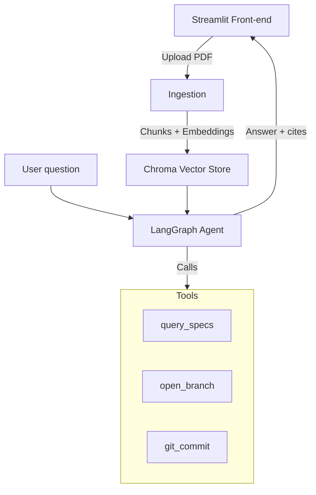

<!-- BEGIN SPEC-BOT OVERVIEW -->
# Spec-Bot – LLM Context & On-Ramp

## 1 · Purpose  
A lightweight RAG-powered assistant that lets construction pros **ask natural-language questions about spec books (PDF)** and receive answers with **page-level citations**. Built on the SoloChain agent scaffold.

## 2 · Core Objectives
| # | Objective | Success metric |
|---|-----------|---------------|
| 1 | Instant spec Q-A with citations | ≤ 3 s response on 400-page PDF |
| 2 | Zero setup for users           | Drag-drop PDF + prompt in browser |
| 3 | Auditability                   | Clickable links jump to page thumbnail |
| 4 | Extensibility                  | Add RFI-draft & submittal tools in v1.1 |

## 3 · High-Level Architecture


*Agent planner*: LangGraph → chooses `query_specs`, Git ops.  
*Retrieval*: PDF → docs → embeddings (OpenAI or Llama).  
*Persistence*: Chroma DB in `./data/<project>/`.

## 4 · Repository Layout
| Path | Description |
|------|-------------|
| `app/`                   | Streamlit UI & handlers |
| `agent/`                 | LangGraph agent core (forked from SoloChain) |
| `tools/`                 | Tool wrappers (`query_specs.py`, git helpers) |
| `data/`                  | Persistent vector stores by project |
| `.github/workflows/`     | CI – lint, pytest, deploy preview |

## 5 · Getting Started (Dev)
```bash
git clone https://github.com/bankszach/spec-bot.git && cd spec-bot
python -m venv .venv && source .venv/bin/activate
pip install -r requirements.txt
cp .env.example .env    # add OPENAI_API_KEY

# ingest sample spec & launch
python scripts/ingest_pdf.py docs/sample_spec.pdf --project demo
streamlit run app/main.py
```

## 6 · Tool Contracts
**`query_specs(question: str, project: str) → dict`**  
Returns:
```json
{
  "answer": "string",
  "citations": [
    { "page": 123, "snippet": "… anodized finish …" }
  ]
}
```

**Git helpers (unchanged)**  
* `open_branch(name)` – create & checkout branch  
* `git_commit(msg, files)` – stage `files[]`, commit

## 7 · Dev Roadmap
- [ ] MVP UI upload & QA  
- [ ] Chroma per-project persistence  
- [ ] e2e test with sample PDF  
- [ ] Deploy (Streamlit Cloud / Vercel)  
- [ ] RFI auto-draft tool

## 8 · Solo-Dev Workflow
1. Open issue for roadmap item  
2. `agent_cli "Spec: implement X"` (opens branch)  
3. Code in Cursor; `pytest`  
4. Push branch; open PR

## 9 · LLM Prompt Context
> *"You are Spec-Bot, an assistant that answers technical spec questions for construction documents. Always cite page numbers and relevant section headers. If unsure, say 'I couldn't locate that requirement in the provided specification.'"*

© 2025 Zach Banks  
<!-- END SPEC-BOT OVERVIEW -->

